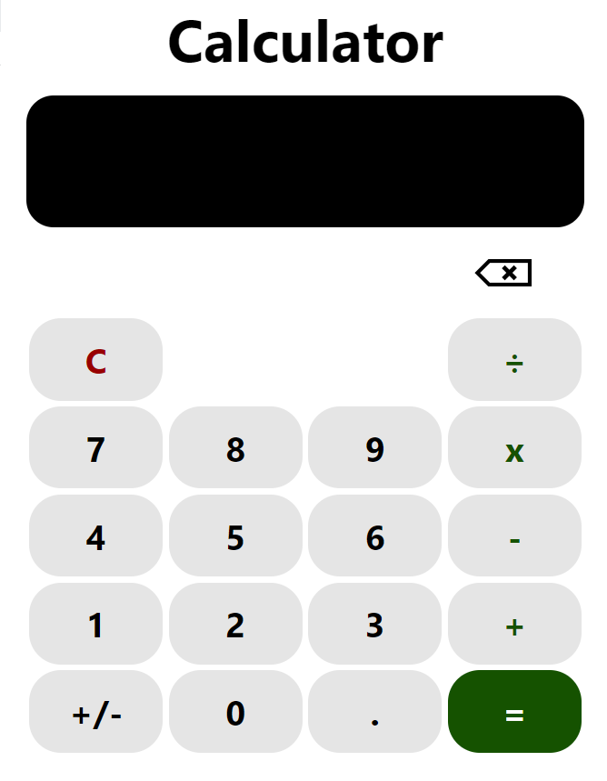

<h1 align="center">
    </img>  
    Calculator | Calculadora

 
 

</h1>

## Summary
 

* [Built with](#built-with) | Construído com
* [Description](#description) | Descrição
* [Funcionalities](#funcionalities) | Funcionalidades
* [Access the project](#access-the-project) | Acesse o projeto
* [Run the project](#run-the-project) | Execute o projeto
* [Developers](#developers) | Desenvolvedores
* [License](#license) | Licença

 

---

 

## Built with

 

 

(<a href="#summary">back to top | voltar ao topo</a>)

---

 

## Description
 

  EN-US

  The calculator can calculate different operations, such as division, multiplication, subtraction and addition. In the same equation, it's possible to have different operators. Above the equation, there'll be the preview of the result. It's also possible to clear the screen, delete the last character and change the sign of the number.

  For the user usability, the buttons have some characteristics that makes the experience more real (with transform, shadows and transitions). When mouse hover the buttons, there's an animation so the user knows it can be pressed. When clicked, there's also an animation so the user knows it clicked the button.
  
  Furthermore, the user recieves a temporary notification when it's not possible to insert the content of the button clicked and how he can work around the problem.

  In addition, the calculator is responsive to different size of devices.

  Lastly, for accessibility, the color of the background of the buttons and the font were approved by the Web Content Accessibility Guideline (WCAG), tested on the site: https://contrastchecker.com/

 

  BR-PT

  A calculadora pode realizar diferentes operações, como divisão, multiplicação, subtração e adição. Na mesma equação, é possível ter diferentes operadores. Acima da equação, haverá a prévia do resultado. Também é possível limpar a tela, deletar o último caractere e mudar o sinal do número.

  Para a usabilidade do usuário, os botões têm algumas características que tornam a experiência mais real (com transform, shadows e transitions). Quando o mouse passa sobre os botões, há uma animação para que o usuário saiba que ele pode ser pressionado. Quando clicado, também há uma animação para que o usuário saiba que clicou no botão.

  Além disso, o usuário recebe uma notificação temporária quando não é possível inserir o conteúdo do botão clicado e como ele pode contornar o problema.

  Ademais, a calculadora é responsiva a diferentes tamanhos de dispositivos.

  Por fim, para acessibilidade, a cor do fundo dos botões e a fonte foram aprovadas pelo Guia de Acessibilidade para Conteúdo da Web (WCAG), testadas no site: https://contrastchecker.com/

(<a href="#summary">back to top | voltar ao topo</a>)

---

 

## Funcionalities

 

  EN-US

✔️ A preview of the result is shown above the equation. 
✔️ By clicking the button "=", the preview becomes the current equation. 
✔️ By clicking the button "+/-", the sign of the number is changed. 
✔️ By clicking the button "C", the calculator screen is cleared. 
✔️ By clicking the button image "delete", the last character is deleted. 
✔️ The calculator is adjusted accordingly to the device screen size. 
 

  BR-PT

✔️ Uma prévia do resultado é exibida acima da equação. 
✔️ Ao clicar no botão "=", a prévia se torna a equação atual. 
✔️ Ao clicar no botão "+/-", o sinal do número é alterado. 
✔️ Ao clicar no botão "C", a tela da calculadora é limpa. 
✔️ Ao clicar na imagem do botão "delete", o último caractere é excluído. 
✔️ A calculadora é ajustada de acordo com o tamanho da tela do dispositivo. 

(<a href="#summary">back to top | voltar ao topo</a>)

---

 

## Access the project

 

* Github link: https://github.com/lfogawa/Calculator

(<a href="#summary">back to top | voltar ao topo</a>)

---

 

## Run the project

 

* CodePen link: https://codepen.io/lfogawa/full/RweZpJm
 
 

EN-US 
Observation: in CodePen, an image link was used for the delete button. However, the orginal code used the path to an image inside the paste. 

 

PT-BR 
Observação: no CodePen, um link de imagem foi utilizado para o botão delete. No entanto, o código original usou o caminho para uma imagem dentro da pasta. 

(<a href="#summary">back to top | voltar ao topo</a>)

---

 

## Developers

 

|  Luís Felipe Ogawa|
| :---: |

Github: https://github.com/lfogawa  
LinkedIn: https://www.linkedin.com/in/lu%C3%ADs-felipe-ogawa/  

(<a href="#summary">back to top | voltar ao topo</a>)

---

 

## License

 

The [MIT License]() (MIT).

Copyright ©️ 2023 - Calculator

(<a href="#summary">back to top | voltar ao topo</a>)
